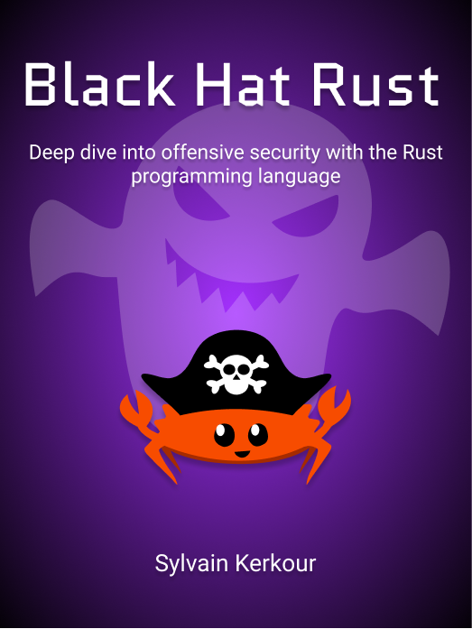

  
  <h1 align="center">Black Hat Rust - Early Access</h1>
  <h3 align="center">Applied offensive security with the Rust programming language</h3>
  <h3 align="center">
    <a href="https://academy.kerkour.com/black-hat-rust?coupon=GITHUB">Buy the book now!</a>
  </h3>

## Summary

Whether in movies or mainstream media, hackers are often romanticized: they are painted as black magic wizards, nasty criminals, or, in the worst cases, as thieves with a hood and a crowbar.
In reality, the spectrum of the profile of the attackers is extremely large, from the bored teenager exploring the internet to sovereign State's armies as well as the unhappy former employee.

What are the motivations of the attackers? How can they break seemingly so easily into any network? What do they do to their victims?
We will put on our black hat and explore the world of offensive security, whether it be cyber attacks, cybercrimes, or cyberwar.
Scanners, exploits, phishing toolkit, implants... From theory to practice, we will explore the arcane of offensive security and build our own offensive tools with the Rust programming language, Stack Overflow's most loved language for five years in a row.

Which programming language allows to craft shellcodes, build servers, create phishing pages? Before Rust, none! Rust is the long-awaited one-size-fits-all programming language meeting all those requirements thanks to its unparalleled guarantees and feature set. Here is why.

<!--
The security programming field is defined by its extremely large scope (from shellcodes to servers and web apps). Rust is the long-awaited one-size-fits-all programming language meeting all those requirements thanks to its unparalleled guarantees and feature set. Here is why.

Rust is turning a new page in the history of programming languages by providing unparalleled guarantees and features, whether it be for defensive or offensive security. I will venture to say that Rust is the long awaited one-size-fits-all programming language. Here is why. -->

Free Updates and DRM Free, of course :)

## Who this book is for

This is NOT a 1000th tutorial about sqlmap and Metasploit, nor will it teach you the fundamentals of programming.

Instead, it's a from-theory-to-practice guide and you may enjoy it if any of the following:

- You keep screaming "show me the code!" when reading about cyber attacks and malwares
- You are a developer and want to learn security
- You are a security engineer and want to learn Rust programming
- You want to learn real-world and idiomatic rust practices
- You believe that the best defense is thinking like an attacker
- You learn by building and love to look under the hood
- You value simplicity and pragmatism
- You develop your own tools and exploits with Python, Ruby, C, Java...
- You want to learn real-world offensive security, not just pentesting
- You want to start making money with bug bounty programs
- You prefer getting things done over analysis paralysis

But I repeat, this book is NOT a computer science book.

<h3>
  <a href="https://academy.kerkour.com/black-hat-rust?coupon=GITHUB">Buy the book now!</a>
</h3>

## Early access

As of today, the book is a work in progress. It is available in the context of an Early Access program which means that the chapters will be sent to you as soon as they are written, and feedback is very much appreciated.

pages available: **300+**

code progress: **~90%**

estimated final publication: **Q3 2021**

estimated number of pages: **~320+**

**In order to thank all the people who will help me make this book a reality, all early access buyers will also receive the following bonus:**
* **A curated list of advanced malware analyses. You will find inside great inspiration when developing your own offensive tools.**

<h3>
  <a href="https://academy.kerkour.com/black-hat-rust?coupon=GITHUB">Buy the book now!</a>
</h3>

## Table of contents

#### 1 - Introduction ✅

### Part I: Reconnaissance

#### 2 - Multi-threaded attack surface discovery (partially available, will be updated during the beta ✅🕒)
How to perform effective reconnaissance? In this chapter, we will build a multi-threaded scanner in order to automate the mapping of the target.

#### 3 - Going full speed with async (partially available, will be updated during the beta ✅🕒)
Unfortunately, when a program spends most of its time in I/O operations, multi-threading is not a panacea. We will learn how async makes Rust code really, really fast and refactor our scanner to async code.

#### 4 - Adding modules with Trait objects (partially available, will be updated during the beta ✅🕒)
We will add more heterogeneous modules to our scanner and will learn how Rust's type system helps create properly designed large software projects.

#### 5 - Crawling the web for OSINT (August 2021 🕒)
Leveraging all we learned previously, we will build an extremely fast web crawler to help us find the needles in the haystack the web is.

### Part II: Exploitation

#### 6 - Finding vulnerabilities (partially available, will be updated during the beta ✅🕒)
Once the external reconnaissance performed, it's time to find entry points. In this chapter we will learn how automated fuzzing can help us to find vulnerabilities that can be exploited to then gain access to our target's systems.

#### 7 - Exploit development (August-September 2021 🕒)
Rust may not be as fast as python when it comes to iterating on quick scripts such as exploits, but as we will see, its powerful type and modules system make it nonetheless a weapon of choice.

#### 8 - Writing shellcodes in Rust (partially available, will be updated during the beta ✅🕒)
Shellcode development is an ungrateful task. Writing assembly by hand is definitely not sexy. Fortunately for us, Rust, one more time, got our back! In this chapter we will learn how to write shellcodes in plain Rust with no_std.

#### 9 - Phishing with WebAssembly (partially available, will be updated during the beta ✅🕒)
When they can't find exploitable hardware or software vulnerability, attackers usually fall back to what is often the weakest link in the chain: Humans.
Again, Rust comes handy and will let us create advanced phishing pages by compiling to WebAssembly.

### Part III: Implant development

#### 10 - A modern RAT (partially available, will be updated during the beta ✅🕒)
A RAT (for Remote Access Tool), also known as implant or beacon, is a kind of software used to perform offensive operations on a target's machines. In this chapter we will build our own RAT communicating to a remote server and database.

#### 11 - Securing communications with end-to-end encryption (partially available, will be updated during the beta ✅🕒)
The consequences of our own infrastructure being compromised or seized can be disastrous. We will add end-to-end encryption to our RAT's communication in order to secure its communications and avoid leaving traces on our servers.

#### 12 - Going multi-platforms (partially available, will be updated during the beta ✅🕒)
Today's computing landscape is extremely fragmented. From Windows to macOS, we can't target only one Operating System to ensure the success of our operations. In this section we will see how Rust's ecosystem is extremely useful when it comes to cross-compilation.

#### 13 - Turning into a worm to increase reach (August-September 2021 🕒)
Once the initial targets compromised, we will capitalize on Rust's excellent reusability to incorporate some parts of our initial scanner to turn our RAT into a worm and reach more targets only accessible from the target's internal network.

#### 14 Conclusion (partially available, will be updated during the beta ✅🕒)
Now it's **your** turn to get things done!

<h3>
  <a href="https://academy.kerkour.com/black-hat-rust?coupon=GITHUB">Buy the book now!</a>
</h3>

## Getting started

**Knowledge has no value if you don't practice!**

Where to start? I've got you covered! I've extracted the security scanner we build in the book from chapters 2, 3, 4, and 7 into [phaser](https://github.com/skerkour/phaser): an automated attack surface mapper and vulnerability scanner.

You can then contribute to your first Rust security project or participate in your first bug bounty program.

## Community

Hey! Welcome you to the Black Hat Rustaceans gang! If you think something in the book or the code can be improved, please [open an issue](https://github.com/skerkour/black-hat-rust/issues). Pull requests are also welcome :)

If you have any questions or ideas, feel free to [join the discussion on the Forum](https://github.com/skerkour/black-hat-rust/discussions)!

## Newsletter

Want to stay updated? I'll write you once a week about avoiding complexity, hacking, and entrepreneurship.

**https://kerkour.com/subscribe**

*I hate spam even more than you do. I'll never share your email, and you can unsubscribe at anytime. Also, there is no tracking or ads.*

## Changelog

You'll find all the updates in the Changelog: https://github.com/skerkour/black-hat-rust/blob/main/CHANGELOG.md
